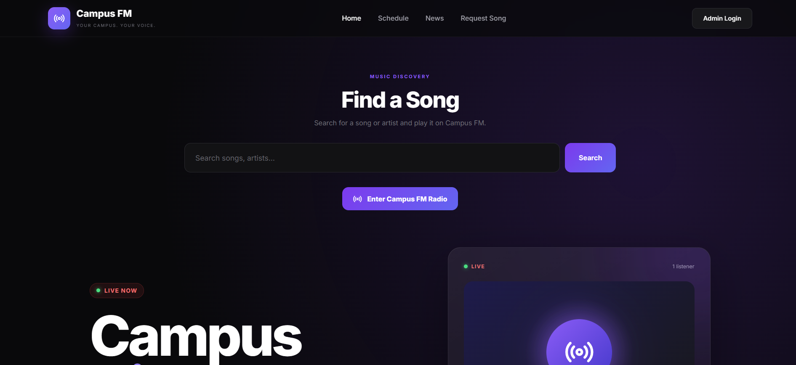
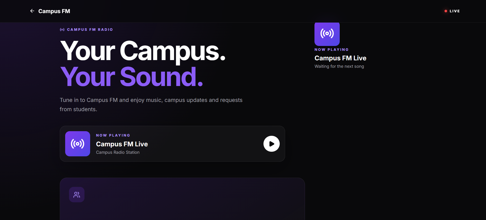
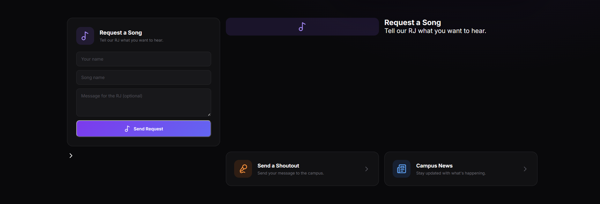
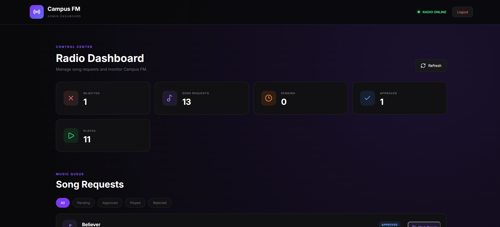
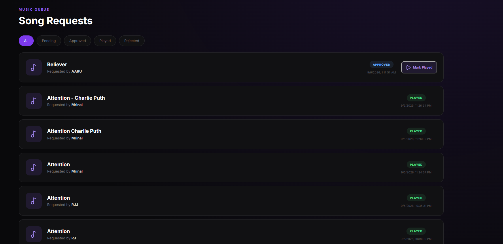

# 🎙️ Campus FM

A modern, full-stack **college radio station web application** built for students and campus communities.

Campus FM allows students to discover music, submit song requests, and listen to a live campus radio station. Administrators can manage requests, approve songs, manage campus content, and control the radio queue.

---

## ✨ Features

- 🎙️ Live Campus FM radio station
- 🎵 Song search and music discovery
- 📝 Student song requests
- 👨‍💼 Admin dashboard for request management
- ✅ Approve / reject song requests
- 🔄 Automatic radio queue
- 🎧 Audius music integration
- 💾 Local MP3 music fallback
- ⚡ Real-time queue updates using Socket.IO
- 📰 Campus news management
- 📅 Radio schedule management
- 📣 Student shoutouts
- 🔐 JWT-based admin authentication
- 🌙 Modern dark, Spotify-inspired interface
- 📱 Responsive UI for desktop and mobile

---

## 🖼️ Website Screenshots

> Replace the placeholder image paths below with your actual screenshots. Create a `screenshots` folder in the repository and put the images inside it.

### 🏠 Homepage



**Screenshot space:**

```text
┌──────────────────────────────────────────────────────────────┐
│                                                              │
│              ADD HOMEPAGE SCREENSHOT HERE                   │
│                                                              │
│                                                              │
└──────────────────────────────────────────────────────────────┘
```

---

### 📻 Radio Station



**Screenshot space:**

```text
┌──────────────────────────────────────────────────────────────┐
│                                                              │
│            ADD RADIO STATION SCREENSHOT HERE                │
│                                                              │
│                                                              │
└──────────────────────────────────────────────────────────────┘
```

---

### 🎵 Song Request



**Screenshot space:**

```text
┌──────────────────────────────────────────────────────────────┐
│                                                              │
│             ADD SONG REQUEST SCREENSHOT HERE                 │
│                                                              │
│                                                              │
└──────────────────────────────────────────────────────────────┘
```

---

### 👨‍💼 Admin Dashboard



**Screenshot space:**

```text
┌──────────────────────────────────────────────────────────────┐
│                                                              │
│            ADD ADMIN DASHBOARD SCREENSHOT HERE              │
│                                                              │
│                                                              │
└──────────────────────────────────────────────────────────────┘
```

---

### 🎧 Radio Queue / Now Playing



**Screenshot space:**

```text
┌──────────────────────────────────────────────────────────────┐
│                                                              │
│              ADD RADIO QUEUE SCREENSHOT HERE                │
│                                                              │
│                                                              │
└──────────────────────────────────────────────────────────────┘
```

---

## 🏗️ System Architecture

```text
                         ┌─────────────────────┐
                         │       Student       │
                         │     Web Browser     │
                         └──────────┬──────────┘
                                    │
                                    ▼
                         ┌─────────────────────┐
                         │   React + Vite      │
                         │      Frontend       │
                         └──────────┬──────────┘
                                    │
                         REST API + Socket.IO
                                    │
                                    ▼
                         ┌─────────────────────┐
                         │   Node.js / Express │
                         │      Backend        │
                         └──────┬──────┬───────┘
                                │      │
                    ┌───────────┘      └────────────┐
                    ▼                               ▼
          ┌──────────────────┐             ┌─────────────────┐
          │ MongoDB / Atlas  │             │      Audius     │
          │ Requests / Queue │             │ Music Discovery │
          │ News / Schedule  │             └─────────────────┘
          │ Shoutouts / Admin│
          └──────────────────┘
                    │
                    ▼
             ┌──────────────┐
             │ Local / GridFS│
             │ Authorized MP3│
             └──────────────┘
```

---

## 🎼 Radio Request Workflow

```text
Student requests a song
        │
        ▼
MongoDB → Pending
        │
        ▼
Admin reviews request
        │
        ▼
Admin approves
        │
        ▼
Search local music first
        │
        ├── Found → Local MP3
        │
        └── Not found → Audius
                         │
                         ▼
                   Playable stream
                         │
                         ▼
                    Radio Queue
                         │
                         ▼
                    /radio page
                         │
                         ▼
                     Now Playing
                         │
                         ▼
                    Song finishes
                         │
                         ▼
                  Next song plays
```

---

## 🔤 Spelling-Friendly Requests

Campus FM is designed so a student can type a request such as:

```text
belivr imagine dragon
```

The backend can search available sources and select the closest playable match.

The matching layer should be used to **identify a song**, not to download copyrighted music from unauthorized websites.

---

## 🛠️ Tech Stack

### Frontend

- React
- Vite
- React Router
- Axios
- Socket.IO Client
- Lucide React
- CSS

### Backend

- Node.js
- Express.js
- MongoDB
- Mongoose
- JWT
- bcryptjs
- Socket.IO
- Axios
- Multer / GridFS for authorized uploaded media

### Deployment

- GitHub
- Render — Backend
- Vercel — Frontend
- MongoDB Atlas — Database

---

## 📁 Project Structure

```text
Campus-FM/
│
├── client/
│   ├── public/
│   ├── src/
│   │   ├── api.js
│   │   ├── App.jsx
│   │   ├── RadioStation.jsx
│   │   ├── AdminDashboard.jsx
│   │   ├── AdminLogin.jsx
│   │   ├── components/
│   │   └── index.css
│   ├── package.json
│   └── ...
│
├── server/
│   ├── middleware/
│   │   └── auth.js
│   ├── models/
│   │   ├── SongRequest.js
│   │   ├── RadioQueue.js
│   │   ├── LocalMusic.js
│   │   └── ...
│   ├── routes/
│   │   ├── requests.js
│   │   ├── queue.js
│   │   ├── music.js
│   │   ├── news.js
│   │   ├── schedule.js
│   │   ├── shoutouts.js
│   │   └── auth.js
│   ├── music/
│   │   └── authorized-audio-files.mp3
│   ├── server.js
│   ├── package.json
│   └── .env
│
├── .gitignore
└── README.md
```

---

## 🚀 Local Development

### 1. Clone the repository

```bash
git clone https://github.com/YOUR-USERNAME/Campus-FM.git
cd Campus-FM
```

### 2. Install backend dependencies

```bash
cd server
npm install
```

### 3. Configure backend environment variables

Create `server/.env`:

```env
MONGO_URI=your_mongodb_connection_string
JWT_SECRET=your_jwt_secret
AUDIUS_API_KEY=your_audius_api_key
CLIENT_URL=http://localhost:5173
BACKEND_URL=http://localhost:5000
```

### 4. Start the backend

```bash
npm run dev
```

### 5. Install frontend dependencies

Open another terminal:

```bash
cd client
npm install
```

### 6. Configure frontend environment variables

Create `client/.env.local`:

```env
VITE_API_URL=http://localhost:5000/api
VITE_SOCKET_URL=http://localhost:5000
```

### 7. Start the frontend

```bash
npm run dev
```

The application will normally be available at:

```text
http://localhost:5173
```

---

## 🔐 Authentication

Admin operations are protected with JWT authentication.

```text
Admin Login
     ↓
JWT generated
     ↓
Stored in browser
     ↓
Axios interceptor
     ↓
Authorization: Bearer <token>
     ↓
Express auth middleware
     ↓
Protected admin API
```

Never commit `.env`, passwords, MongoDB credentials, JWT secrets, or private API keys to GitHub.

---

## 🔄 Real-Time Radio

Socket.IO is used to keep the radio interface synchronized.

When an admin approves a request:

```text
Admin Dashboard
      ↓
Backend
      ↓
RadioQueue updated
      ↓
Socket.IO: queueUpdated
      ↓
Radio Station page
      ↓
Queue refreshes automatically
```

The actual station player exists on the `/radio` page so the main homepage does not unexpectedly play audio.

---

## 🎧 Music Sources

Campus FM can use two sources:

### Local music

Authorized MP3 files can be stored and referenced through the local music catalog.

### Audius

Audius can be used for online music discovery and playable streams where the requested track is available.

The system follows this priority:

```text
Local music
    ↓
If no playable match
    ↓
Audius
    ↓
If still unavailable
    ↓
Show no playable version available
```

---

## ☁️ Deployment

### Backend — Render

- Root Directory: `server`
- Build Command: `npm install`
- Start Command: `npm start`

Recommended backend environment variables:

```env
MONGO_URI=...
JWT_SECRET=...
AUDIUS_API_KEY=...
CLIENT_URL=https://your-frontend.vercel.app
BACKEND_URL=https://your-backend.onrender.com
```

### Frontend — Vercel

- Root Directory: `client`
- Framework: Vite
- Build Command: `npm run build`
- Output Directory: `dist`

Frontend environment variables:

```env
VITE_API_URL=https://your-backend.onrender.com/api
VITE_SOCKET_URL=https://your-backend.onrender.com
```

---

## 📸 Recommended Screenshot Folder

Add a folder named:

```text
screenshots/
```

Recommended files:

```text
screenshots/
├── homepage.png
├── radio-station.png
├── song-request.png
├── admin-dashboard.png
├── radio-queue.png
└── mobile-view.png
```

Then update the image names in this README when you have the final screenshots.

---

## 🎯 Future Improvements

- AI-assisted song matching
- Better fuzzy search for spelling mistakes
- Admin audio upload interface
- MongoDB GridFS media management
- Persistent station state
- Listener synchronization
- Current-song progress synchronization
- Analytics and listener history
- Schedule automation
- PWA/mobile support

---

## 👨‍💻 Author

**Campus FM — College Radio Web Application**

Built as a full-stack college project using React, Node.js, Express, MongoDB, Socket.IO, and modern web technologies.

---

## 📄 License

Add your preferred project license here, for example:

```text
MIT License
```

